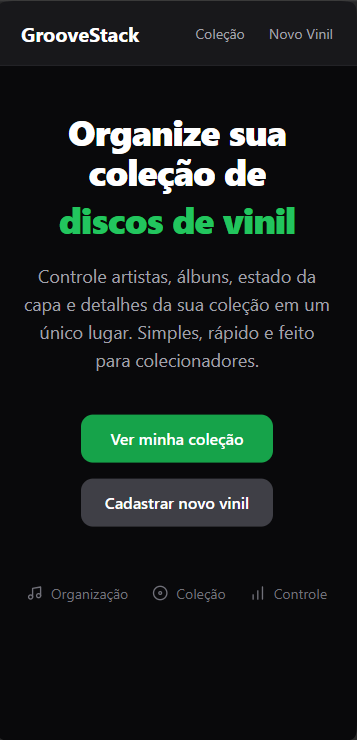

# 🎶 GrooveStack - Gerenciador de Discos

Uma aplicação web moderna para **gerenciamento de discos de vinil**, permitindo cadastrar, visualizar, editar e remover álbuns de forma simples, rápida e com um layout limpo e profissional.

Este projeto foi desenvolvido com foco em **boas práticas de Front-End**, organização de código e experiência do usuário.

---

## ✨ Funcionalidades

* 📀 Listagem de discos de vinil
* ➕ Cadastro de novos álbuns
* ✏️ Edição de informações do disco
* 🗑️ Exclusão de discos
* 🖼️ Exibição de capas 
* ⭐ Classificação do disco (ex: Bom, Ótimo, etc.)
* 📅 Ano de lançamento

---

## 🖼️ Preview


---

## 🚀 Tecnologias Utilizadas

### Front-End

* **React**
* **Vite**
* **React Router DOM**
* **JavaScript (ES6+)**
* **CSS / Tailwind CSS**

### Back-End (API)

* **Node.js**
* **Express**
* **API REST** 

---

## 📂 Estrutura do Projeto

```bash
src/
├── components/      # Componentes reutilizáveis
├── pages/           # Páginas (List, Create, Edit)
├── services/        # Configuração da API
├── styles/          # Estilos globais
├── App.jsx
└── main.jsx
```

---

## 🔌 API

A aplicação consome uma API REST para persistência dos dados.

### Exemplo de endpoints:

```http
GET    /vinyls
GET    /vinyls/:id
POST   /vinyls
PUT    /vinyls/:id
DELETE /vinyls/:id
```

---

## ⚙️ Como Rodar o Projeto

### 1️⃣ Clone o repositório

```bash
git clone https://github.com/andre-0303/grooveStack.git
```

### 2️⃣ Instale as dependências

```bash
npm install
```

### 3️⃣ Inicie o projeto

```bash
npm run dev
```

A aplicação estará disponível em:

```
http://localhost:5173
```

---

## 🎯 Objetivo do Projeto

Este projeto foi criado para:

* Praticar **CRUD completo em React**
* Trabalhar consumo de **API REST**
* Aplicar conceitos de **componentização**
* Melhorar **UI/UX** em aplicações web
* Servir como **projeto de portfólio**

---

## 📌 Próximas Melhorias

* 🔍 Busca por discos
* 🎛️ Filtros por ano ou avaliação
* 🌙 Tema escuro
* 📱 Layout mobile-first aprimorado
* 🔐 Autenticação

---

## 👨‍💻 Autor

Desenvolvido por **André Bandeira** 🚀
Front-End Developer

---

Se este projeto te ajudou ou te inspirou, deixe uma ⭐ no repositório!
